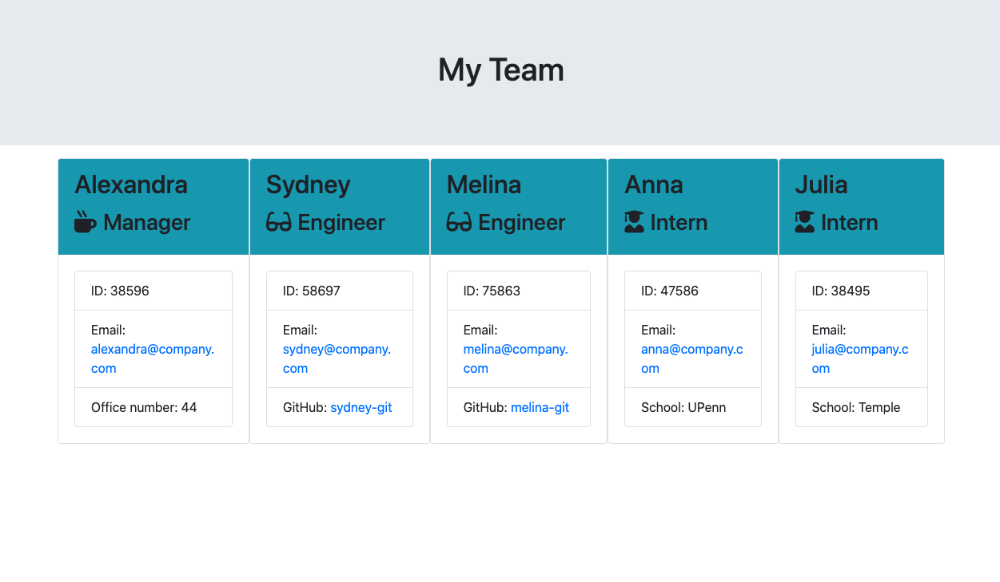
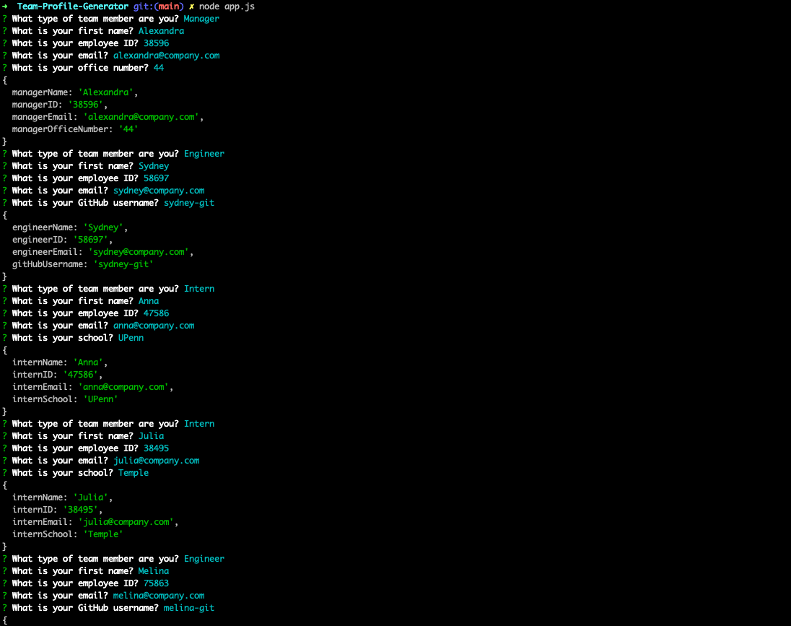

## Team-Profile-Generator

[Video of deployed app!](https://drive.google.com/file/d/153rYBavvPT8mCoSXJ_n9y7x2R2JcmgGs/view)

[Video of tests](https://drive.google.com/file/d/1cBbOyKDr5ASQflJaeiaH4GV-yEjq81B4/view)

## Description
 A Node.js application that will build a software engineering team generator command line application. A Node CLI that takes in information about employees and generates an HTML webpage that displays summaries for each person. The user can input any number of team members, and they may be a mix of engineers and interns. This assignment must also pass all unit tests. When the user has completed building the team, the application will create an HTML file that displays a nicely formatted team roster based on the information provided by the user. Completed for Penn LPS Coding Bootcamp.
## Table of Contents
- [Description](#description)
- [Installation](#installation)
- [Usage](#usage)
- [License](#license)
- [Contributing](#contributing)
- [Tests](#tests)
- [Questions](#questions)
## Installation
Package.json, so make sure to npm install as well as inquierer package. Jest test is used.
## Usage
A program that generates an app page that displays cards with brief information about managers, engingeers, and interns for an organization. A team.html page is generated by a user's input in the terminal.

As a manager
I want to generate a webpage that displays my team's basic info
so that I have quick access to emails and GitHub profiles.

## License
ISC
## Contributing
[Alexandra Hionis](https://github.com/Alexandra-Hionis/README-Generator)
## Tests
Jest
## Questions
GitHub: https://github.com/Alexandra-Hionis  
Email: Alexandra.hionis@gmail.com  
